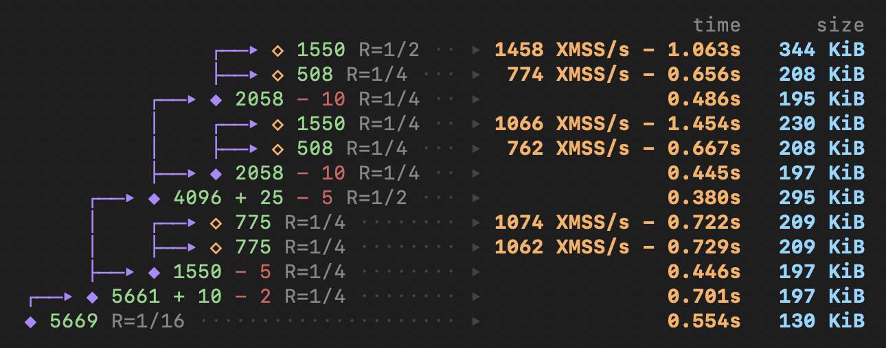

This is the maintained Farcaster ed25519 prover fork. It follows Farcaster's current signing
method while retaining our own prover implementation. The named leaf statement is
`farcaster-ed25519-blake3-20-air-v1` (scheme ID 0); envelope v4 carries that ID and the VK hash.
The future signature seam is the leaf-to-recursion-digest boundary. Unknown schemes are rejected;
no second scheme or negotiation system is implemented. See the sibling farcaster-blobs
`docs/round8-reader.md` for the wire and reader contract.

Current operator procedure: [the sibling runbook](../../farcaster-blobs/docs/backfill-runbook.md).
A clone does not contain the generated prover/verifier artifacts or a proof hosting service.
The benchmarks below are historical upstream XMSS/recursion measurements, not Farcaster archive
throughput or a resource allowance. Multi-blob publication epochs are not the shipped envelope-v4
reader. No crate-level Cargo test or build is assumed safe under a 4 GB / 3 minute budget.
Current proving tests can require substantially more memory; use an explicit operator-approved
command and bounded measurement. A local proof test does not establish nonzero on-chain registration.

<h1 align="center">leanVM</h1>

<p align="center">
  
</p>

Minimal hash-based zkVM, for a Post-Quantum Ethereum.

<p align="center">
  <a href="https://github.com/leanEthereum/leanVM/releases/download/spec-latest/minimal_zkVM.pdf"></a>
  <a href="crates/lean_compiler/zkDSL.md"></a>
  <a href="crates/lean_prover/python-verifier/verifier.py"></a>
</p>

## Proving System


- multilinear with [WHIR](https://eprint.iacr.org/2024/1586.pdf), allowing polynomial stacking (reducing proof size)
- [SuperSpartan](https://eprint.iacr.org/2023/552.pdf), with [AIR-specific optimizations](https://solvable.group/posts/super-air/#fnref:1)
- [Logup](https://eprint.iacr.org/2023/1284.pdf), with a system of buses similar to [OpenVM](https://openvm.dev/whitepaper.pdf)

The VM design is inspired by the famous [Cairo paper](https://eprint.iacr.org/2021/1063.pdf).


## Benchmarks

Machine: M4 Max 48GB (CPU only)

*Expect incoming perf improvements.*

### XMSS aggregation

```bash
cargo run --release -- xmss --n-signatures 1550 --log-inv-rate 1
```

| WHIR rate | Proven Regime         | Proximity Gaps Conjecture |
| --------- | --------------------- | ------------------------- |
| 1/2       | 1426 XMSS/s - 327 KiB | 1481 XMSS/s - 171 KiB     |
| 1/4       | 1027 XMSS/s - 220 KiB | 1049 XMSS/s - 122 KiB     |


(Proving throughput - proof size)

### Recursion

Aggregating together n previously aggregated signatures, each containing 700 XMSS.


```bash
cargo run --release -- recursion --n 2 --log-inv-rate 2
```


| n   | WHIR rate | Proven Regime               | Proximity Gaps Conjecture   |
| --- | --------- | --------------------------- | --------------------------- |
| 1   | 1/2       | 0.22s = 1 x 0.22s - 268 KiB | 0.16s = 1 x 0.16s - 136 KiB |
| 1   | 1/4       | 0.25s = 1 x 0.25s - 179 KiB | 0.18s = 1 x 0.18s - 93 KiB  |
| 2   | 1/2       | 0.53s = 2 x 0.26s - 265 KiB | 0.33s = 2 x 0.16s - 152 KiB |
| 2   | 1/4       | 0.47s = 2 x 0.24s - 187 KiB | 0.34s = 2 x 0.17s - 98 KiB  |
| 3   | 1/2       | 0.7s = 3 x 0.23s - 299 KiB  | 0.48s = 3 x 0.16s - 144 KiB |
| 3   | 1/4       | 0.67s = 3 x 0.22s - 183 KiB | 0.44s = 3 x 0.15s - 107 KiB |
| 4   | 1/2       | 1.04s = 4 x 0.26s - 293 KiB | 0.62s = 4 x 0.15s - 160 KiB |
| 4   | 1/4       | 0.87s = 4 x 0.22s - 199 KiB | 0.64s = 4 x 0.16s - 105 KiB |


(time for n->1 recursive aggregation - proof size)

### Bonus: unbounded recursive aggregation

```bash
cargo run --release -- fancy-aggregation
```



(Proven regime)

## Farcaster prover profiling

The full ed25519 proving tests exceed 4 GB even with small leaf counts; run only explicit test
filters, one prover at a time, without a concurrent build. An unfiltered `--lib` suite includes
a 6,745-row proof. `ed25519::tests::test_ed25519_node_of_leaves` uses `NODE_LEAF_N=16 NODE_K=2`
for the small recursive check.

When running a prebuilt libtest executable directly, set `RUST_MIN_STACK=8388608` before launch.
Direct execution bypasses `.cargo/config.toml`, which already sets a larger `RUST_MIN_STACK`
for Cargo-launched commands. The direct node test overflowed the default worker stack; operator
runs passed at 8 MiB and 32 MiB. This reserves stack address space, not that much resident RAM
for every thread. See the Farcaster repository's `docs/zk-prover-memory.md` for the before-build
control, phase profiles and operator commands.

Provers can load an audited full release cache without re-hashing its dense table with Poseidon.
Run `audit-prover-cache EXISTING_FULL_CACHE OUTPUT` offline before distributing an artifact or
pin. It compares the full execution records and every table field, and independently recomputes
the Poseidon VK hash. Install its output as `prover-bytecode-v1.bin` inside `FB_ZK_CACHE` (default
`~/.cache/fb-zk`). Startup checks the hardcoded SHA-512 pin before decoding; the stored VK and
proof protocol are unchanged. Never source the trusted digest from the artifact or a manifest.
The existing keyed cache/compiler remains a fallback. No verifier-only dictionary can serve as
a prover's instruction cache.

## Security

### snark

The declared LogUp component budget is **123 bits** at the supported table maxima (derived bound 123.463485326 bits). WHIR retains its **124-bit configuration target**, using JohnsonBound and the quintic KoalaBear extension, so existing proof parameters and recursion/VK artifacts remain compatible. These component budgets are not a new composed or Fiat-Shamir security proof. `sub_protocols/tests/soundness_logup.rs` checks the exact fraction count against the exact field order; `EF::bits()` rounds up and is not entropy. The earlier blanket 124-bit claim was unsupported at the declared maxima. The separately documented XMSS/hash widths below have not changed. Conjectured-security benchmarks remain explicitly distinct from the default JohnsonBound configuration.

### XMSS

Currently, we use an [XMSS](crates/xmss/xmss.md) with hash digests of 4 field elements ≈ 124 bits. Tweaks and public parameters ensure domain separation. An analysis in the ROM (resp. QROM), inspired by the section 3.1 of [Tight adaptive reprogramming in the QROM](https://arxiv.org/pdf/2010.15103) would lead to ≈ 124 (resp. 62) bits of classical (resp. quantum) security. Going to 128 / 64 bits of classical / quantum security, i.e. NIST level 1 (in the ROM/QROM), is an ongoing effort. It requires either:
- hash digests of 5 field elements (drawback: we need to double the hash chain length from 8 to 16 if we want to stay below one IPv6 MTU = 1280 bytes)
- a new prime, close to 32 bits (typically p = 125.2^25 + 1) or 64 bits ([goldilocks](https://2π.com/22/goldilocks/), p = 2^64 - 2^32 + 1). The [goldilocks branch](https://github.com/leanEthereum/leanVM/tree/goldilocks) is actively maintained, the only blocker is performance degradation.

It's important to mention that a security analysis in the ROM / QROM is not the most conservative. In particular, [eprint 2025/055](https://eprint.iacr.org/2025/055.pdf)'s security proof holds in the standard model (at the cost of bigger hash digests): the implementation is available in the [leanSig](https://github.com/leanEthereum/leanSig) repository. A compatible version of leanVM can be found in the [devnet5](https://github.com/leanEthereum/leanVM/tree/devnet5) branch.

## Credits

- [Plonky3](https://github.com/Plonky3/Plonky3) for its various performant crates
- [whir-p3](https://github.com/tcoratger/whir-p3): a Plonky3-compatible WHIR implementation
- [Whirlaway](https://github.com/TomWambsgans/Whirlaway): Multilinear snark for AIR + minimal zkVM

